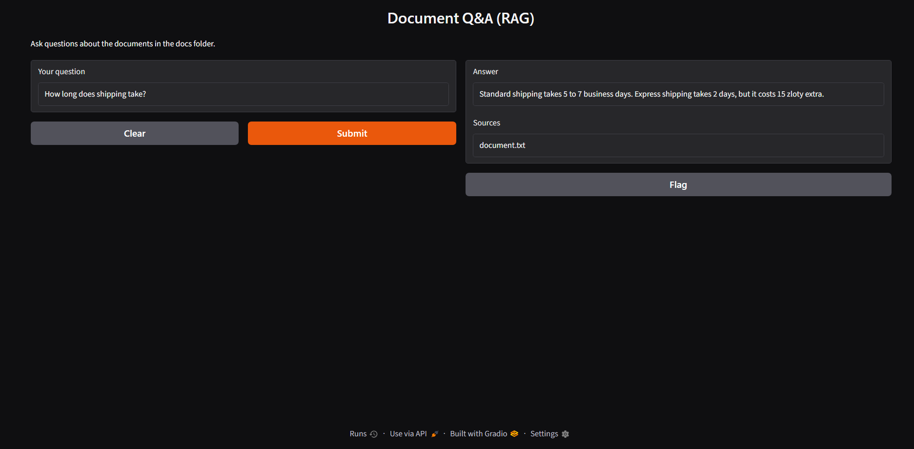

# Hugging Face RAG Document Q&A

Ask questions about your own documents (PDF and text files) and get answers grounded only in those files, with the source file shown.

## How it works

Documents -> chunking -> embeddings -> semantic search -> Hugging Face LLM -> grounded answer + sources

- Chunking: ~500-character pieces with overlap
- Embeddings: all-MiniLM-L6-v2 (sentence-transformers)
- Semantic search: cosine similarity finds the closest chunks
- Generation: Llama-3.1-8B-Instruct (Hugging Face Inference) answers using only those chunks
- Grounding: if nothing relevant is found, it says I don't know

## Features

- Reads multiple .txt and .pdf files from the docs folder
- Shows which file each answer came from
- Similarity threshold to avoid irrelevant sources
- Gradio web UI
- Evaluation suite: 9/9 test questions passing (eval.py)

## Run it

pip install sentence-transformers huggingface_hub pypdf gradio

Set HF_TOKEN to your Hugging Face token, then run: python app.py

## Possible improvements

Better chunking by headings, LLM-as-judge evaluation, and live hosting.
